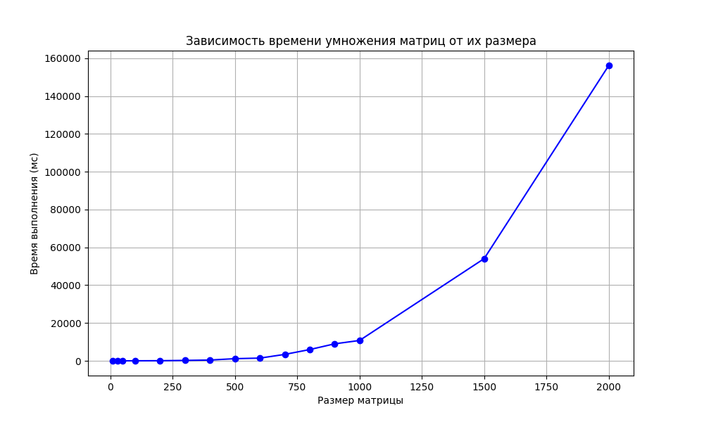

# Лабораторная работа №1  

В данной работе реализовано умножение квадратных матриц с проверкой корректности результатов и анализом производительности классического алгоритма.  

### Структура проекта  
- **`Mul_Matrix.cpp`** - генерирует пары случайных матриц (размеры от 10×10 до 2000×2000), выполняет их умножение стандартным алгоритмом и замеряет и сохраняет время выполнения  
- **`verification.py`** - верификации результатов (сравнение с NumPy), построение графика производительности  

### Результаты эксперимента  
- Все проверки корректности умножения пройдены успешно  
- Наблюдается ожидаемый кубический рост времени выполнения:  
   - 10×10 - ~0.1 мс  
   - 1000×1000 - ~10 сек  
   - 2000×2000 - ~160 сек  

*Работу выполнила: Гололобова Полина Витальевна*  
*Группа: 6313-100503D*  
