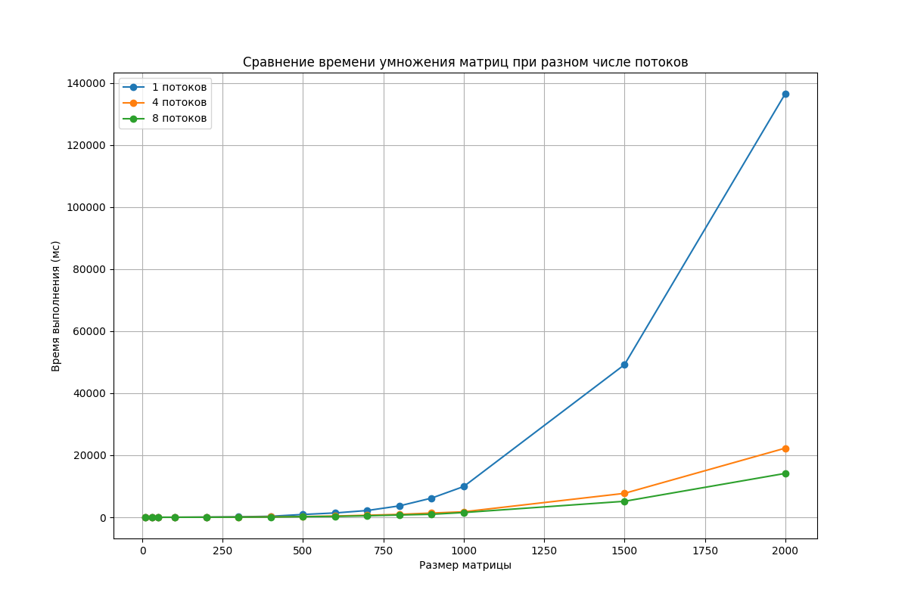

# Лабораторная работа №2  

Исследование ускорения матричного умножения при использовании многопоточности с помощью технологии OpenMP.

### Основные изменения  

1. В `Mul_Matrix.cpp` добавлена параллельная обработка с директивой `#pragma omp parallel for`, векторизация внутреннего цикла через `#pragma omp simd`, поддержка разного числа потоков (1, 4, 8)  

2. В `verification.py` - сравнение производительности для разного числа потоков, построение сравнительного графика  

### Результаты эксперимента  
  

- Для малых матриц (до 300×300) многопоточность дает незначительный выигрыш  
- На матрицах 1000×1000 и более:  
  - 4 потока: ускорение в ~2.5 раза  
  - 8 потоков: ускорение в ~3.8 раза  
- Максимальный эффект достигается на больших матрицах (2000×2000)  

Результаты для каждого варианта потоков (1,4 или 8) сохраняются в отдельные файлы:  
  - `stats_threads_1.txt`  
  - `stats_threads_4.txt`  
  - `stats_threads_8.txt`  

*Работу выполнила: Гололобова Полина Витальевна*  
*Группа: 6313-100503D*  

