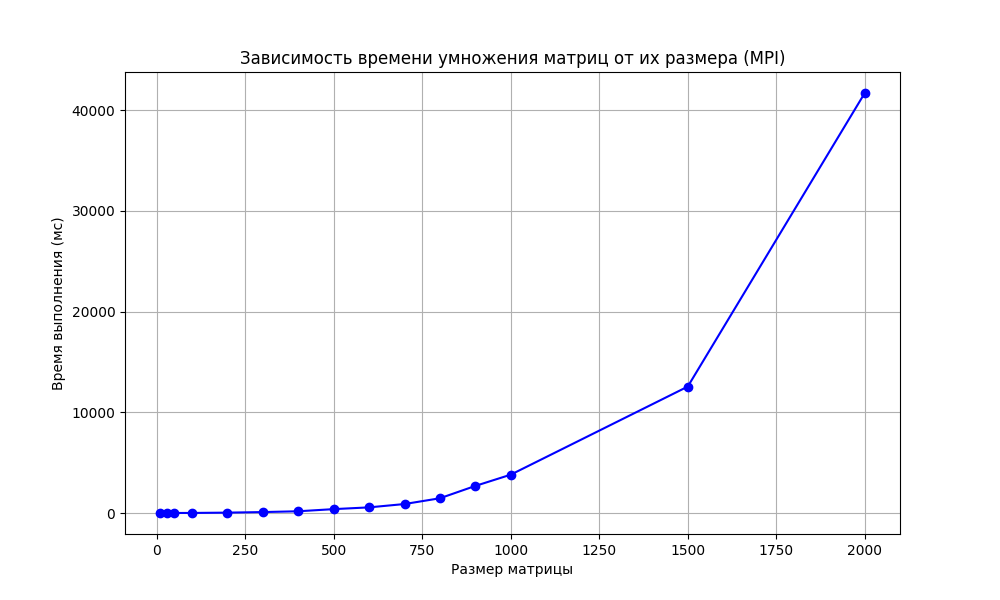

# Лабораторная работа №3  

Исследование эффективности распределенного умножения матриц с использованием технологии MPI для параллельных вычислений на кластере.

 Основные изменения в коде  
1. **MPI-реализация (`mul_matrix.cpp`)**:
   - Добавлена инициализация MPI-окружения (`MPI_Init`)
   - Использование `MPI_Bcast` для рассылки второй матрицы
   - Сбор результатов на root-процессе с помощью `MPI_Send/MPI_Recv`
   - Точные замеры времени через `MPI_Wtime`

2. **Верификация (`verification.py`)** - проверка корректности через сравнение с NumPy и построение графика производительности

### Результаты эксперимента  
  

**Наблюдения:**  
- На матрицах 1000×1000 наблюдается ускорение в ~3-5 раз (зависит от числа процессов)
- Максимальная эффективность достигается на больших матрицах (2000×2000)

### Работа на супер компьютере

**Важное уточнение:**не удалось зайти в супер компьютер по своему паролю, возможная причина - изменение пароля 2 года назад. Работала с чужого аккаунта - Верховой А.И 2022-01829. Создала в нем свою папку Gololobova и работала непосредственно из нее.

slurm_xxxxx_1 файлы в конце имеют обозначение с каким количеством процессов запускался код, первый столбец - размер матрицы, второй - время умножения матриц

*Работу выполнила: Гололобова Полина Витальевна*  
*Группа: 6313-100503D*  

